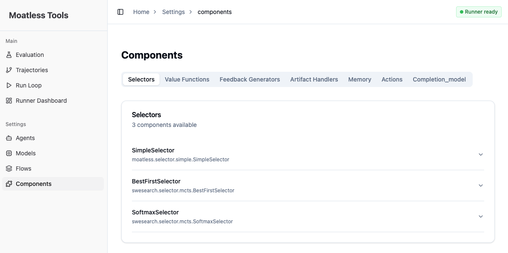
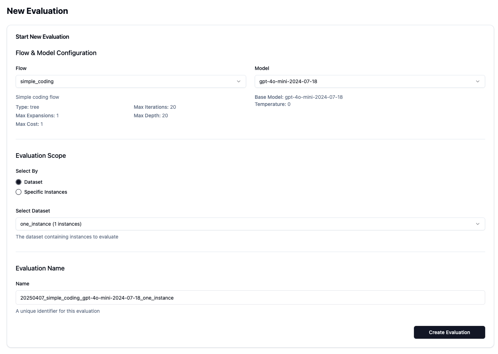
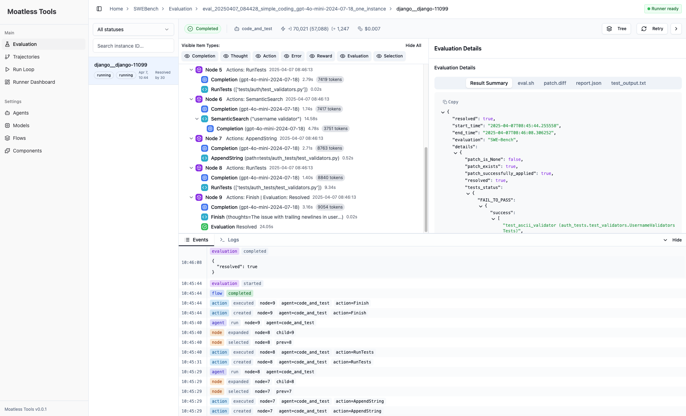

# Getting started

Follow these steps to set up the environment using Docker:

## 1. Prerequisited

### System Requirements

* MacOS with Docker Desktop support
* Linux
* Windows with WSL and Docker Desktop support

### API Keys

1. At least one LLM provider API key (e.g., OpenAI, Anthropic, etc.)
2. A Voyage AI API key from [voyageai.com](https://voyageai.com) to use the pre-embedded vector stores for SWE-Bench instances.

## 2. Clone this repository:
   ```shell
   git clone https://github.com/aorwall/moatless-tree-search.git
   cd moatless-tree-search
   git checkout moatless-tools
   ```

## 3. Set environment variables

Create a `.env` file in the moatless-api directory:

```shell
cp .env.example .env
```
   
Set 
```shell
# Point to this repository's swesearch directory to extend with SWE-Search components
# Replace with your actual path to this repository
MOATLESS_COMPONENTS_PATH="/path/to/moatless-tree-search"

# Directory where configuration and trajectories will be saved
# Can be set to the existing .moatless directory in this repo
MOATLESS_DIR="/path/to/your/swe-search-2/.moatless"

# Use Docker as runner
MOATLESS_RUNNER=docker

# Required: At least one LLM provider API key
OPENAI_API_KEY="<your-key>"
ANTHROPIC_API_KEY="<your-key>"
HUGGINGFACE_API_KEY="<your-key>"
DEEPSEEK_API_KEY="<your-key>"

# ...or Base URL for custom LLM API service
CUSTOM_LLM_API_BASE="<your-base-url>"
CUSTOM_LLM_API_KEY="<your-key>"

# API Key for Voyage Embeddings to run SWE-Bench instances
VOYAGE_API_KEY="<your-key>"
```

## 4. Run the server
Run the server with Docker Compose.

```shell
make run
```

Check logs:
```shell
make logs
```

Check if the server is running by visiting http://localhost:8000 in your web browser. Go to http://localhost:8000/settings/components to verify that all expected components have been initialized.

For example, we expect the selectors
`swesearch.selector.mcts.BestFirstSelector` and  `swesearch.selector.mcts.SoftmaxSelector`




6. Verify 
Test whether everything works by running a simple evaluation of one of the most basic instances in SWE-Bench.

Start by creating a new evaluation. Set the flow to "simple_coding," which will run an agent with actions to locate, edit, and test code, as well as use tool calls. Choose the model "gpt-4o-mini" and select the dataset "one_instance."



An evaluation should now have been created. Click "Start" to run the evaluation.

Currently, event handling is not working perfectly, so use "Sync results" to manually synchronize trajectories and evaluation results.

Once the evaluation is complete, we can expect the instances to be resolved.




## 6. To shut down the server:
```shell
make stop
```
